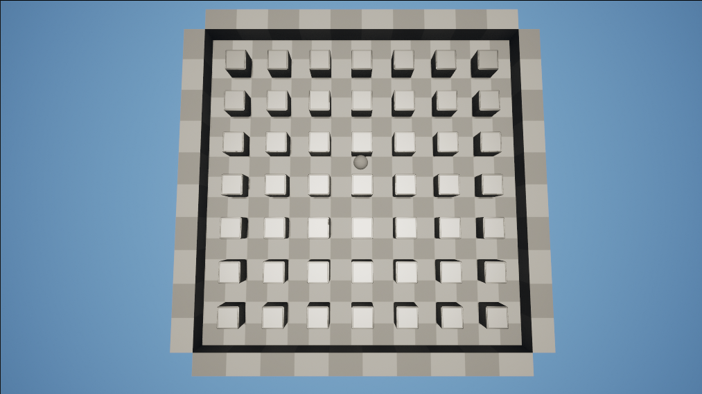
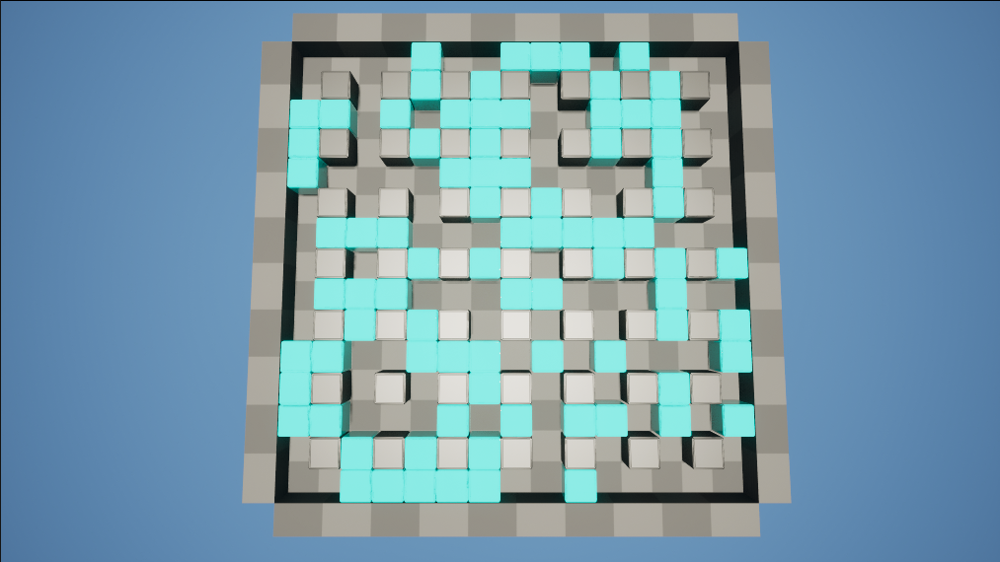
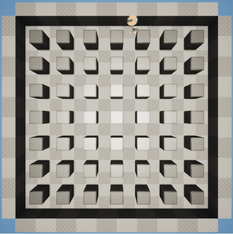

# Bomberman
UE5.3 C++和蓝图实现的经典炸弹人
## 常见问题
GetWorld生成Actor必须要在对象已经初始化之后，如果在构造函数中调用会返回nullptr导致UE编译时崩溃  
## 不可销毁的障碍物
Block类，头文件中声明组件
```c++
	UPROPERTY(EditAnywhere, Category = "Component")
	UStaticMeshComponent* Block;
```
构造函数中创建静态网格体，在派生蓝图中设置静态网格体
```c++
ABlock::ABlock()
{
	// Set this actor to call Tick() every frame.  You can turn this off to improve performance if you don't need it.
	PrimaryActorTick.bCanEverTick = true;
	Block = CreateDefaultSubobject<UStaticMeshComponent>(TEXT("Block"));
	RootComponent = Block;
}
```
## 生成不可销毁的障碍物
BlockGenerator类，头文件声明属性和生成函数
```c++
	UPROPERTY(EditAnywhere, Category = "Block Generation")
	TSubclassOf<class ABlock>Block;
	UPROPERTY(EditAnywhere, Category = "Block Generation|Setting")
	int Height = 15;
	UPROPERTY(EditAnywhere, Category = "Block Generation|Setting")
	int Width = 15;
	UPROPERTY(EditAnywhere, Category = "Block Generation|Setting")
	int BlockSize = 100;
	void SpawnBlock();
```
在奇数位置生成障碍物
```c++
void ABlockGenerator::SpawnBlock()
{
	for (int i = 0; i < Width; i++) {
		for (int j = 0; j < Height; j++) {
			if (i % 2 != 0 && j % 2 != 0) {
				FVector Position = FVector((i - Width / 2) * BlockSize + 50, (j - Height / 2) * BlockSize + 50, 150);
				GetWorld()->SpawnActor<ABlock>(Block, Position, FRotator::ZeroRotator);
			}
		}
	}
}
```
在开始函数而不是构造函数调用生成障碍物方法
```c++
void ABlockGenerator::BeginPlay()
{
	Super::BeginPlay();
	SpawnBlock(); // 必须在对象完全初始化之后调用，否则GetWorld返回nullptr
}
```

## 主摄像机
MainCamera类，继承自摄像机，派生蓝图使用
```c++
protected:
	virtual void BeginPlay();
	APlayerController* PC;
```
将玩家控制器的视角设置为当前对象，并实现平滑过渡
```c++
void AMainCamera::BeginPlay()
{
	Super::BeginPlay();
	PC = UGameplayStatics::GetPlayerController(this, 0);
	PC->SetViewTargetWithBlend(this, 0);
}
```
## 可销毁方块
同不可销毁障碍物构建方法
### 随机生成可销毁方块
玩家出生的三角位置不可以生成可销毁方块
```c++
	SpawnPlayerPositions = {
	FIntPoint(0, 0), FIntPoint(0, 1), FIntPoint(1, 0),
	FIntPoint(Width - 1, 0), FIntPoint(Width - 1, 1), FIntPoint(Width - 2, 0),
	FIntPoint(0, Height - 1), FIntPoint(0, Height - 2), FIntPoint(1, Height - 1),
	FIntPoint(Width - 1, Height - 1), FIntPoint(Width - 1, Height - 2), FIntPoint(Width - 2, Height - 1)
	};
```
奇数位置不可生成
```c++
void ABlockGenerator::FindSpawnBBPosition()
{
	for (int i = 0; i < Width; i++) {
		for (int j = 0; j < Height; j++) {
			if (SpawnPlayerPositions.Contains(FIntPoint(i, j))) {
				continue;
			}
			if (i % 2 == 0 || j % 2 == 0) {
				FVector Position = FVector((i - Width / 2) * BlockSize + 50, (j - Height / 2) * BlockSize + 50, 150);
				BreakBlockPositions.Add(Position);
			}
		}
	}
}
```
设置一个生成可销毁方块的密度值
```c++
	UPROPERTY(EditAnywhere, meta = (ClampMin = "0", ClampMax = "1"), Category = "Block Generation|Setting")
	float BlockDensity=1;
```
随机找一个可生成的位置生成方块，在位置集合中去掉该位置，重复直到达到数量
```c++
void ABlockGenerator::SpawnBreakBlock()
{
	int BreakBlockNum = BreakBlockPositions.Num() * BlockDensity;
	for (int i = 0; i < BreakBlockNum; i++) {
		int Index = FMath::RandRange(0, BreakBlockPositions.Num() - 1);
		GetWorld()->SpawnActor<ABreakableBlock>(BreakableBlock, BreakBlockPositions[Index], FRotator::ZeroRotator);
		BreakBlockPositions.RemoveAt(Index);
	}
}

```

## 移动人物
人物类继承Character，赋值骨骼网格体  
上下移动
```c++
void ABombermanPlayer::MoveVertical(float Value)
{
	AddMovementInput(FVector::ForwardVector,Value);
}
```
左右移动
```c++
void ABombermanPlayer::MoveHorizontal(float Value)
{
	AddMovementInput(FVector::RightVector,Value);
}
```
绑定轴映射
```c++
// Called to bind functionality to input
void ABombermanPlayer::SetupPlayerInputComponent(UInputComponent* PlayerInputComponent)
{
	Super::SetupPlayerInputComponent(PlayerInputComponent);
	PlayerInputComponent->BindAxis("MoveVertical", this, &ABombermanPlayer::MoveVertical);
	PlayerInputComponent->BindAxis("MoveHorizontal", this, &ABombermanPlayer::MoveHorizontal);
}

```
创建新的游戏模式蓝图，项目设置中更新游戏模式和默认Pawn类
## 生成炸弹
炸弹类同之前两个方块构造，碰撞预设设置为NoCollision，让小机器人可以走过去，不然有时候会卡住不能动  
给小机器人增加生成炸弹方法
```c++
void ABombermanPlayer::SpawnBomb()
{
	if (Bomb) {
		FVector Location = GetActorLocation();
		Location.Z = 140;
		GetWorld()->SpawnActor<ABomb>(Bomb,Location , FRotator::ZeroRotator);
	}
}
```
绑定操作映射，按下空格放炸弹
```c++
void ABombermanPlayer::SetupPlayerInputComponent(UInputComponent* PlayerInputComponent)
{
	Super::SetupPlayerInputComponent(PlayerInputComponent);
	PlayerInputComponent->BindAxis("MoveVertical", this, &ABombermanPlayer::MoveVertical);
	PlayerInputComponent->BindAxis("MoveHorizontal", this, &ABombermanPlayer::MoveHorizontal);
	PlayerInputComponent->BindAction("SpawnBomb", IE_Pressed, this, &ABombermanPlayer::SpawnBomb);
}
```

## 炸弹阻挡小机器人
目前是小机器人可以穿过炸弹，设置了Bomb的碰撞预设为NoCollision，可以给Bomb添加碰撞检测
```c++
void ABomb::BeginPlay()
{
	Super::BeginPlay();
	BoxCollision->OnComponentEndOverlap.AddDynamic(this, &ABomb::OnOverlapEnd);
}
```
当第一次碰到小机器人离开的时候，重设碰撞响应为阻挡
```c++
void ABomb::OnOverlapEnd(UPrimitiveComponent* OverlappedComponent, AActor* OtherActor, UPrimitiveComponent* OtherComp, int32 OtherBodyIndex)
{
	if (OtherActor == GetOwner()) {
		BoxCollision->SetCollisionResponseToChannel(ECollisionChannel::ECC_Pawn,ECollisionResponse::ECR_Block);
	}
}
```
生成炸弹时添加参数拥有者为小机器人
```c++
void ABombermanPlayer::SpawnBomb()
{
	if (Bomb) {
		FActorSpawnParameters Parameters;
		Parameters.Owner = this;
		FVector Location = GetActorLocation();
		Location.Z = 140;
		GetWorld()->SpawnActor<ABomb>(Bomb,Location , FRotator::ZeroRotator,Parameters);
	}
}
```
这样当小机器人第一次生成炸弹时会和炸弹重叠，再次碰到炸弹时会被阻挡

## 修正炸弹生成的位置
目前炸弹跟随小机器人的位置生成，但是理论上炸弹应该在每个格子的中心生成，格子中心坐标是类似于（150，-150），先考虑正数的情况，先减去50归百，那么两个格子之间的分界线是50，例如600到700之间是650，先和100取余，和50比较大小，比50大划分给700，根据负数取余的规则，负数的情况也适合
```c++
void ABombermanPlayer::SpawnBomb()
{
	if (Bomb) {
		FActorSpawnParameters Parameters;
		Parameters.Owner = this;
		FVector Location = GetActorLocation();
		auto Modify = [](int i)->int {
			i = i - 50;
			int mode = i % 100;
			i = i - mode;
			if (mode > 50)
				i = i + 100;
			return i + 50;
			};
		Location.X = Modify((int)Location.X);
		Location.Y = Modify((int)Location.Y);
		Location.Z = 140;
		GetWorld()->SpawnActor<ABomb>(Bomb,Location , FRotator::ZeroRotator,Parameters);
	}
}
```
实测发现负数取模得到的还是负数，例如-120%100得到的是-20而不是80，因此需要修改
```c++
		auto Modify = [](int i)->int {
			i = i - 50;
			int mode = i % 100;
			i = i - mode;
			if (mode > 0) {
				if (mode > 50)
					i = i + 100;
				return i + 50;
			}
			else {
				if (mode > -50)
					i = i + 100;
				return i - 50;
			}
        };
```

## 炸弹销毁
设置定时器让炸弹销毁
```c++
	FTimerHandle TimerHandleExplode;
	UPROPERTY(EditAnywhere, Category = "Explode")
	float ExplodeTime = 1;
	void Explode();
```
炸弹自我销毁
```c++
void ABomb::Explode()
{
	Destroy();
}

```
设置定时器调用的函数
```c++
void ABomb::BeginPlay()
{
	Super::BeginPlay();
	BoxCollision->OnComponentEndOverlap.AddDynamic(this, &ABomb::OnOverlapEnd);
	GetWorldTimerManager().SetTimer(TimerHandleExplode, this, &ABomb::Explode, ExplodeTime);
}
```

## 炸弹爆炸特效
添加初学者内容包，里面有爆炸的粒子系统，创建一个爆炸C++类派生蓝图使用爆炸粒子系统，设置爆炸强度和自我销毁时间
```c++
public:	
	// Sets default values for this actor's properties
	AExplode();
	UPROPERTY(BlueprintReadWrite, Category = "Explode")
	float ExplodeIntensity = 1;
protected:
	// Called when the game starts or when spawned
	virtual void BeginPlay() override;
	FTimerHandle TimerHandleExplode;
	UPROPERTY(EditAnywhere, Category = "Explode")
	float ExplodeTime = 1;
	void Explode();
```
在炸弹即将销毁的时候生成爆炸效果
```c++
void ABomb::Explode()
{
	if(ExplodeEffect)
		GetWorld()->SpawnActor<AExplode>(ExplodeEffect, GetActorLocation(), FRotator::ZeroRotator);
	Destroy();
}
```

## 炸弹爆炸范围
根据爆炸强度在水平方向和竖直方向上爆炸，写一个函数在某个位置生成爆炸特效
```c++
void ABomb::ExplodeHere(FVector Location)
{
	if (ExplodeEffect)
		GetWorld()->SpawnActor<AExplode>(ExplodeEffect, Location, FRotator::ZeroRotator);
}
```
先在此地爆炸，再向四个方向生成爆炸
```c++
void ABomb::Explode()
{
	if (ExplodeEffect)
		GetWorld()->SpawnActor<AExplode>(ExplodeEffect, GetActorLocation(), FRotator::ZeroRotator);
	for (int i = 1; i <= ExplodeIntensity; i++) {
		ExplodeHere(GetActorLocation() + i * FVector(100, 0, 0));
		ExplodeHere(GetActorLocation() + i * FVector(0, 100, 0));
		ExplodeHere(GetActorLocation() + i * FVector(-100, 0, 0));
		ExplodeHere(GetActorLocation() + i * FVector(0, -100, 0));
	}
	Destroy();
}
```

## 炸毁方块
利用射线检测两个位置之间是否存在方块，使用类型转换，如果转换成功说明是可销毁的方块
```c++
void ABomb::ExplodeHere(FVector Location)
{
	if (ExplodeEffect)
		GetWorld()->SpawnActor<AExplode>(ExplodeEffect, Location, FRotator::ZeroRotator);
	FHitResult HitResult;
	FCollisionQueryParams CollisionParams;
	if (GetWorld()->LineTraceSingleByChannel(HitResult, GetActorLocation(), Location, ECollisionChannel::ECC_WorldStatic, CollisionParams))
	{
		ABreakableBlock*BreakBlock = Cast<ABreakableBlock>(HitResult.GetActor());
		if (BreakBlock) {
			BreakBlock->Destroy();
		}
	}
}
```

## 新增道具-强化爆炸范围
给炸弹人新增属性爆炸强度
```c++
	UPROPERTY(EditAnywhere, Category = "Explode")
	int ExplodeIntensity = 1;
```
在生成炸弹的时候给炸弹赋值爆炸强度
```c++
		ABomb* NewBomb=GetWorld()->SpawnActor<ABomb>(Bomb, Location, FRotator::ZeroRotator, Parameters);
		NewBomb->ExplodeIntensity = this->ExplodeIntensity;
```
道具类检测与炸弹人的碰撞，使用Overlap需要将网格体碰撞预设为NoCollision，不然无法重叠
```c++
void AProp::OnOverlapBegin(UPrimitiveComponent* OverlappedComponent, AActor* OtherActor, UPrimitiveComponent* OtherComp, int32 OtherBodyIndex, bool bFromSweep, const FHitResult& SweepHitResult)
{
	GEngine->AddOnScreenDebugMessage(-1, 5.0f, FColor::Red, TEXT("We are using FPSCharacter."));
	ABombermanPlayer* Player = Cast<ABombermanPlayer>(OtherActor);
	if (Player) {
		Player->ExplodeIntensity++;
		Destroy();
	}
}
```

## 几率掉落道具
给可销毁的方块设置一个概率，以该概率掉落道具
```c++
	UPROPERTY(EditAnywhere, Category = "DropProp")
	TSubclassOf<AProp>Prop;
	UPROPERTY(EditAnywhere, Category = "DropProp")
	float DropPropOdds = 0.5f;
```
重写一个可销毁方块的销毁函数，以一定概率生成道具
```c++
void ABreakableBlock::OnDestroy()
{
	if(FMath::RandRange(0,1)<DropPropOdds)
		GetWorld()->SpawnActor<AProp>(Prop, GetActorLocation(), FRotator::ZeroRotator);
	Destroy();
}
```

## HUD倒计时
创建一个控件蓝图，添加画布面板-垂直框-文本，写一个继承UserWidget的C++类，绑定同名文本，更改控件蓝图的父类为该C++类
```c++
	UPROPERTY(Meta=(BindWidget))
	class UTextBlock* RemainTimer;
```
设置文本
```c++
void UBombmanHUD::SetRemainTimer(FText TimerText)
{
	RemainTimer->SetText(TimerText);
}
```
创建游戏模式，设置游戏时间，声明属性，派生游戏模式蓝图，更改蓝图父类为C++类
```c++
	UPROPERTY(EditAnywhere, Category = "Setting")
	float CountdownTime = 300;
	FText TimeText;
	class UBombmanHUD* BombmanHUD;
```
更新时间，转化时间字符串
```c++
void ABombermanGameMode::Tick(float DeltaSeconds)
{
    Super::Tick(DeltaSeconds);
    CountdownTime -= DeltaSeconds;
    FTimespan CountdownTimespan = FTimespan::FromSeconds(CountdownTime);
    FString FormattedTime = FString::Printf(TEXT("%02d:%02d"), CountdownTimespan.GetMinutes(), CountdownTimespan.GetSeconds());
    TimeText = FText::FromString(FormattedTime);
    BombmanHUD->SetRemainTimer(TimeText);
}
```
添加该控件蓝图到视口，路径加_C
```c++
void ABombermanGameMode::BeginPlay()
{
	Super::BeginPlay();
	BombmanHUD = CreateWidget<UBombmanHUD>(GetWorld(), LoadClass<UBombmanHUD>(this, TEXT("/Script/UMGEditor.WidgetBlueprint'/Game/Blueprint/WBP_HUD.WBP_HUD_C'")));
	BombmanHUD->AddToViewport();
}
```

## 游戏结束
添加游戏结束文字和面板
```c++
	UPROPERTY(Meta = (BindWidget))
	class UCanvasPanel* MenuBackground;
	UPROPERTY(Meta = (BindWidget))
	class UTextBlock* GameResult;
	UPROPERTY(EditAnywhere, Category = "Setting")
	FText WinText = FText::FromString(TEXT("You Win!"));
	UPROPERTY(EditAnywhere, Category = "Setting")
	FText LoseText = FText::FromString(TEXT("You Lost!"));
```
根据游戏结束状态设置文案
```c++
void UBombmanHUD::SetGameResult(bool Win)
{
	if (Win)
		GameResult->SetText(WinText);
	else
		GameResult->SetText(LoseText);
	MenuBackground->SetVisibility(ESlateVisibility::Visible);
}
```
游戏模式添加GameOver方法调用设置游戏结束状态方法
```c++
void ABombermanGameMode::GameOver(bool Win)
{
	BombmanHUD->SetGameResult(Win);
}
```
炸弹类引用游戏模式
```c++
void ABomb::BeginPlay()
{
	Super::BeginPlay();
	BoxCollision->OnComponentEndOverlap.AddDynamic(this, &ABomb::OnOverlapEnd);
	GetWorldTimerManager().SetTimer(TimerHandleExplode, this, &ABomb::Explode, ExplodeTime);
	GameMode = Cast<ABombermanGameMode>(UGameplayStatics::GetGameMode(this));
}
```
炸弹爆炸时检测是否炸到小机器人
```c++
void ABomb::ExplodeHere(FVector Location)
{
	if (ExplodeEffect)
		GetWorld()->SpawnActor<AExplode>(ExplodeEffect, Location, FRotator::ZeroRotator);
	FHitResult HitResult;
	FCollisionQueryParams CollisionParams;
	if (GetWorld()->LineTraceSingleByChannel(HitResult, GetActorLocation(), Location, ECollisionChannel::ECC_WorldStatic, CollisionParams))
	{
		ABreakableBlock*BreakBlock = Cast<ABreakableBlock>(HitResult.GetActor());
		if (BreakBlock) {
			BreakBlock->OnDestroy();
		}
		else {
			ABombermanPlayer* Player = Cast<ABombermanPlayer>(HitResult.GetActor());
			if (Player) {
				GameMode->GameOver(false);
			}
		}
	}
}
```

## 重新开始
游戏模式里面游戏结束时启用鼠标
```c++
void ABombermanGameMode::GameOver(bool Win)
{
	UGameplayStatics::GetPlayerController(this, 0)->bShowMouseCursor = true;
	BombmanHUD->SetGameResult(Win);
}
```
重新加载关卡
```c++
void ABombermanGameMode::Restart()
{
	UGameplayStatics::OpenLevel(this, "Bomber");
}
```
声明绑定按钮和调用函数，注意按钮点击事件绑定的函数必须加UFUNCTION()否则无法调用
```c++
	virtual bool Initialize()override;
	UPROPERTY(Meta = (BindWidget))
	class UButton* RestartButton;
	UFUNCTION()
	void Replay();
```
点击按钮调用事件调用游戏模式的重新开始
```c++
void UBombmanHUD::Replay()
{
	GEngine->AddOnScreenDebugMessage(-1, 5.0f, FColor::Cyan, TEXT("Hey, restart."));
	Cast<ABombermanGameMode>(UGameplayStatics::GetGameMode(this))->Restart();
}
```
初始化里面绑定按钮点击事件
```c++
bool UBombmanHUD::Initialize()
{
	if(!Super::Initialize())
	return false;
	RestartButton->OnClicked.AddDynamic(this, &UBombmanHUD::Replay);
	return true;
}
```
## 游戏胜利条件设置
设置游戏胜利的条件为销毁所有方块，给游戏模式添加可销毁方块数量，在生成可销毁方块的时候更新这个值
```c++
void ABlockGenerator::SpawnBreakBlock()
{
	int BreakBlockNum = BreakBlockPositions.Num() * BlockDensity;
	Cast<ABombermanGameMode>(UGameplayStatics::GetGameMode(this))->BreakableBlockNum = BreakBlockNum;
	for (int i = 0; i < BreakBlockNum; i++) {
		int Index = FMath::RandRange(0, BreakBlockPositions.Num() - 1);
		GetWorld()->SpawnActor<ABreakableBlock>(BreakableBlock, BreakBlockPositions[Index], FRotator::ZeroRotator);
		BreakBlockPositions.RemoveAt(Index);
	}
}
```
在方块被销毁的时候，更新游戏模式中的记录
```c++
void ABreakableBlock::OnDestroy()
{
	if(FMath::RandRange(0,1)<DropPropOdds)
		GetWorld()->SpawnActor<AProp>(Prop, GetActorLocation(), FRotator::ZeroRotator);
	Cast<ABombermanGameMode>(UGameplayStatics::GetGameMode(this))->BreakableBlockNum--;
	Destroy();
}
```
游戏模式添加判断游戏结束的方法
```c++
bool ABombermanGameMode::IsGameOver()
{
	if (BreakableBlockNum == 0)
		return true;
	return false;
}
```
每帧判断游戏是否结束
```c++
void ABombermanGameMode::Tick(float DeltaSeconds)
{
	if (IsGameOver()) {
		GameOver(true);
		return;
	}
	Super::Tick(DeltaSeconds);
	CountdownTime -= DeltaSeconds;
	FTimespan CountdownTimespan = FTimespan::FromSeconds(CountdownTime);
	FString FormattedTime = FString::Printf(TEXT("%02d:%02d"), CountdownTimespan.GetMinutes(), CountdownTimespan.GetSeconds());
	TimeText = FText::FromString(FormattedTime);
	BombmanHUD->SetRemainTimer(TimeText);
}
```
